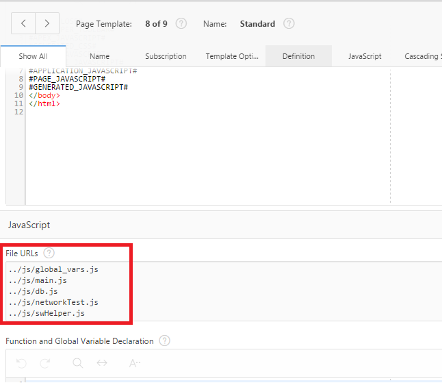
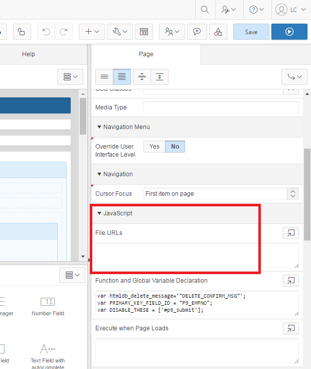
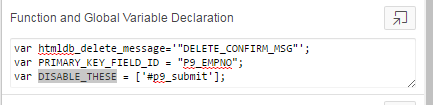
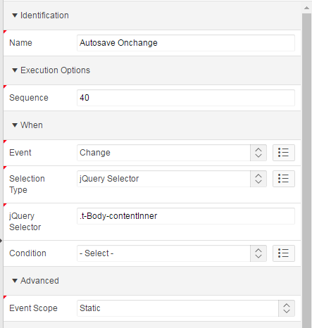
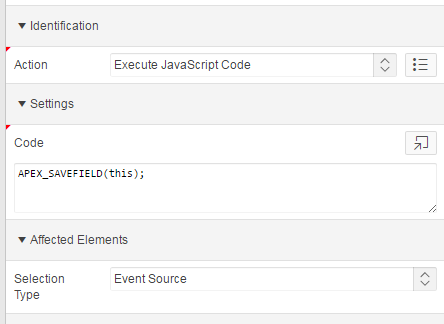

ServiceWorker-Demo
==================

ServiceWorker-Demo makes use of two browser APIs to offer client-side
page persistence for Oracle APEX applications:

1.  **ServiceWorker** allows Javascript files to run as "service
    workers" - background processes that can intercept network requests
    and offer an alternative to the browser cache. We use this to save
    static resources, like the page HTML, CSS, and JS.

2.  **IndexedDB** is a transaction-based client-side database that can
    store arbitrary Javascript objects. We use IndexedDB here to store
    form and form field data from the page. By default, we update our
    IndexedDB on change events and at fixed intervals. On page load,
    form field data is reset to its default values; we offer the option
    either continue, discarding the saved IndexedDB data, or to restore
    form field from the IndexedDB.

**Note that regions and items that the client hasn't loaded yet will**
***not*** **work offline.** This includes items that open a popup
window, pages that source data from SQL queries, and pages that the
browser has not previously seen before going offline. Because of way
that APEX stores session state data in the URL, it's difficult to
determine which pages to be cached in advance. If possible, limit
offline availability to a single page that doesn't pull data from the
server after page load.

**Note also that we have no way of detecting which user is signed in
when offline.** This is stored in the session number, which is entirely
server-side.

Installation and Setup
======================

TL;DR
-----

1.  Ask sysadmin to enable HTTPS. (generate *and sign* an SSL
    certificate for Tomcat).

2.  Ask sysadmin to copy `S:\FINGROUP\Documents\DryDock
    FMM\ServiceWorker-Demo\sw.js` to
    `$CATALINA_HOME/webapps/ROOT/sw.js` on the server.

3.  Ask sysadmin to restart Tomcat / reload the ROOT application.

4.  Upload everything in `S:\FINGROUP\Documents\DryDock
    FMM\ServiceWorker-Demo\js` as static application files. If you’re
    planning on changing them often, ask sysadmin to copy the contents
    of the js folder into the ROOT folder as well.

5.  Paste the following lines into Javascript &gt; File URL on global
    page or page template in APEX.
    ```
    #APP_IMAGES#/main.js
    #APP_IMAGES#/db.js
    #APP_IMAGES#/networkTest.js
    #APP_IMAGES#/global_vars.js
    #APP_IMAGES#/swHelper.js
    #APP_IMAGES#/status.css
    ../sw.js
    ```
    If you’re serving the js files through the filesystem, paste these instead:
    ```
    #APP_IMAGES#/status.css
    ../js/global_vars.js
    ../js/main.js
    ../js/db.js
    ../js/networkTest.js
    ../js/swHelper.js
    ../sw.js
    ```
        
6.  Upload the CSS as a static application file.

        

Tomcat configuration
--------------------

***HTTPS / TLS / SSL*** must be enabled for ServiceWorker to work - the
ServiceWorker standard requires that pages that serve a ServiceWorker
must have a secure origin. See
here([original](https://www.mulesoft.com/tcat/tomcat-ssl),
[archive.is](http://archive.is/wRldn)) for a guide to enabling SSL in
Tomcat.

### sw.js

***sw.js*** must be placed in the *ROOT webapp* if Oracle Rest Data
Services is configured to run as a servlet under Apache Tomcat. This is
a security restriction imposed by the ServiceWorker standard - the scope
of the ServiceWorker must be higher or equal to the page location.

Effectively, this means that if the page is served at
`example.com/ords/f?p=123:345`, then sw.js must be served at
`example.com/sw.js` or `example.com/ords/sw.js`.

On the filesystem, this looks like **`$CATALINA_HOME/webapps/ROOT/sw.js`**
if the file is to be served at `example.com/sw.js`.

Other JS files
--------------

All other javascript files - those under the ***js*** directory - can be
either served under the filesystem or uploaded as a shared component for
the application.

Upload other files individually under `Applicati on X >
Shared Components > Static Application Files`.

CSS Files
---------

We use a CSS file to format a status indicator on the page. Upload the
status.css file as a static application file.

Referencing files
-----------------

All Javascript files must be referenced on page or page templates where
ServiceWorker and IndexedDB functionality is required.

The easiest way to do this is under the **File URLs** section while
editing a page’s or template’s properties - one line per file.

Template:



Page:



For files uploaded to the filesystem, use these:
```
    ../js/global_vars.js
    ../js/main.js
    ../js/db.js
    ../js/networkTest.js
    ../js/swHelper.js
    ../status.css
    ../sw.js
```
For files uploaded as shared components, use these:
```
    #APP_IMAGES#/main.js
    #APP_IMAGES#/db.js
    #APP_IMAGES#/networkTest.js
    #APP_IMAGES#/global_vars.js
    #APP_IMAGES#/swHelper.js
    #APP_IMAGES#/status.css
    ../sw.js
```

Using ServiceWorker-Demo
========================

TL;DR
-----

1.  Create modal dialog in Inline Dialog region with static ID. Paste static ID into `MODAL_DIALOG_ID` in `global_vars.js` so that our code can open it on pageload.

2.  Call `APEX_LOADALL() and APEX_DISCARDALL()` Javascript functions when user makes a choice in the modal dialog.

3.  Call `APEX_SAVEALL()` when you want to save the state of all fields on the page.

4.  Call `APEX_SAVETHIS(this)` with a Change dynamic event that triggers on change for a jQuery selector for .t-Body-contentInner.

5.  Paste this:

        var PRIMARY_KEY_FIELD_ID = ‘$ITEM_NAME’;
    into Function and Global Variable Declaration on an **individual page**.
    
    `$ITEM_NAME` above needs to be replaced with the name of an item that is a primary key for the report or page.

1.  There must be a static region on the page that indicates status. See below for source.

2.  Items that should be disabled when the page is offline should have static IDs set and appropriate jQuery selectors placed into the `DISABLE_THESE` array in Function and Global Variable Declaration per page.

3.  If the page breaks, `Developer Tools[F12] > Application > Clear Storage.` If things still keep breaking, go to `chrome://serviceworker-internals/` and click all of the unregister buttons.

Intro
-----

ServiceWorker will automatically cache and serve pages without human intervention, but IndexedDB requires some work for integration with APEX.

The page will need

1.  an **inline dialog region** that displays on page load, prompting
    the user to load or discard locally-saved changes.

2.  A **save button** that forces all fields on a page to be saved.

3.  A status indicator forces all fields on the page to be saved.

4.  A **Change dynamic action** that saves an individual field on
    focus out.

5.  A **primary key field** that holds the primary key for an object.

Modal dialog
------------

main.js will, on page load, attempt to determine if there's a
discrepancy between the input fields on the page and the saved values in
IndexedDB; if there is, a modal dialog prompts the user to either
restore or discard the changes.

The dialog region should have a **static ID** set under the `Advanced`
section of its region properties. The same static ID should be set in
the `MODAL_DIALOG_ID` variable in the `global_vars.js` file. This
static ID should be used across all pages that need a modal restore
dialog.

The dialog should have two buttons: one to load values from IndexedDB,
and another to discard values from IndexedDB. They should have dynamic
actions attached that execute `APEX_LOADALL()` and `APEX_DISCARDALL()`
as Javascript, respectively.

Save Local Action
-----------------

The Save Locally button should have a dynamic action that that executes
`APEX_SAVEALL()` as Javascript upon click.

Status indicator
----------------

The status indicator should be a static content region with source
```html
<div>
    Network: <span id="networkStatus" class="willHighlight status highlight"></span>
    </br>
    </br>
    Time Last Saved: <span id="timeLastSaved" class="willHighlight"></span>
</div>
```
Make sure `status.css` is included in the page or the page’s template.

Disable on Offline
------------------

We will periodically ping the host server in order to determine when
we’ve lost connection to the server. The interval for offline checks can
be controlled by changing the `_NETWORK_CHECK_INTERVAL` variable in
`global_vars.js`. We can also disable parts of the page when the network
is offline; appropriate jQuery selectors for these elements must be
placed in an array global variable called `DISABLE_THESE` for each page.



Change dynamic action
---------------------

The Change dynamic action should fire when any input field within the
specified jQuery selected element changes(usually, when one clicks away
from a field).

The event should fire upon a `Change` of a `jQuery Selector`, most
likely the content body, `.t-Body-contentInner`. The associated action
should affect only the `event source`; it should execute
`APEX_SAVEFIELD(this)` as JavaScript.





Field-based Database Name
-------------------------

IndexedDB will attempt to create separate databases for different
reports that are viewed on the same page by using the value of an item
on the page, defined in the Javascript variable `PRIMARY_KEY_FIELD_ID`.
Make sure the value assigned to this variable is unique for different
items viewed on the same page. This should be placed in the Function and
Global Variable Declaration section on a page.

Force clear all page assets
===========================

Sometimes the ServiceWorker may keep caching an old version of a file or
the IndexedDB may index the wrong values, particularly when the source
for each of these are changed.

In production, increment the version numbers in `sw.js` and `db.js` to
force the scripts to drop previous versions.

In development, unregister the current ServiceWorker and purge the cache
and local storage through `Developer Tools > Application > Clear Storage` - check all of the boxes before selecting
`Clear Site Data`.
